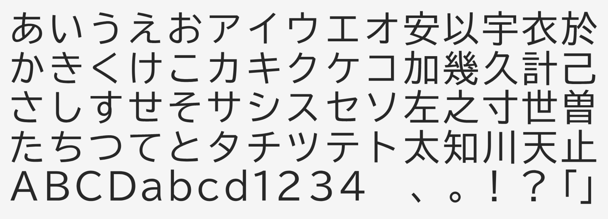

# Morisawa BIZ UDGothic

<!--[![][Fontbakery]](https://googlefonts.github.io/morisawa-biz-ud-gothic/fontbakery/fontbakery-report.html)
[![][Universal]](https://googlefonts.github.io/morisawa-biz-ud-gothic/fontbakery/fontbakery-report.html)
[![][GF Profile]](https://googlefonts.github.io/morisawa-biz-ud-gothic/fontbakery/fontbakery-report.html)
[![][Outline Correctness]](https://googlefonts.github.io/morisawa-biz-ud-gothic/fontbakery/fontbakery-report.html)
[![][Shaping]](https://googlefonts.github.io/morisawa-biz-ud-gothic/fontbakery/fontbakery-report.html)

[Fontbakery]: https://img.shields.io/endpoint?url=https%3A%2F%2Fraw.githubusercontent.com%2Fgooglefonts%2Fmorisawa-biz-ud-gothic%2Fgh-pages%2Fbadges%2Foverall.json
[GF Profile]: https://img.shields.io/endpoint?url=https%3A%2F%2Fraw.githubusercontent.com%2Fgooglefonts%2Fmorisawa-biz-ud-gothic%2Fgh-pages%2Fbadges%2FGoogleFonts.json
[Outline Correctness]: https://img.shields.io/endpoint?url=https%3A%2F%2Fraw.githubusercontent.com%2Fgooglefonts%2Fmorisawa-biz-ud-gothic%2Fgh-pages%2Fbadges%2FOutlineCorrectnessChecks.json
[Shaping]: https://img.shields.io/endpoint?url=https%3A%2F%2Fraw.githubusercontent.com%2Fgooglefonts%2Fmorisawa-biz-ud-gothic%2Fgh-pages%2Fbadges%2FShapingChecks.json
[Universal]: https://img.shields.io/endpoint?url=https%3A%2F%2Fraw.githubusercontent.com%2Fgooglefonts%2Fmorisawa-biz-ud-gothic%2Fgh-pages%2Fbadges%2FUniversal.json
-->
モリサワのBIZ UDゴシックは、教育やビジネス文書作成などに活用できるよう、より多くの方にとって読みやすく使いやすいように設計されたユニバーサルデザインフォントです。読みやすさとデザインバランスに優れた、すっきりとしたUDゴシック書体で、漢字の省略できるハネやゲタを取ることで、文字をクリアに見せています。大きめな字面でも文字としてのかたちのバランスを損ねないよう、フトコロなどの空間を細かく調整しています。かなは漢字に比べてやや小ぶりに作られており、細いウエイトで長文を組むとほどよい抑揚が生まれます。

BIZ UD Gothic is a universal design typeface designed to be easy to read and ideal for education and business documentation. It is a highly legible and well-balanced design sans serif. In order to make the kanji more clear and identifiable, the letterforms are simplified by omitting hane (hook) and geta (the vertical lines extending beyond horizontal strokes at the bottom of kanji). Counters and other spaces are finely adjusted so that the overall balance of the type is not impaired even with the use in relatively large size. The kana are made slightly smaller than the kanji to give a good rhythm and flow when setting long texts in the lighter weights.

Download the latest version of the fonts [from the releases page](https://github.com/googlefonts/morisawa-biz-ud-gothic/releases).

## About Morisawa

モリサワは、1924 年に世界に先駆けて邦文写真植字機を発明して以来、一貫してタイポグラフィの未来をみつめて研究開発を続けているフォントメーカーです。日本語および多言語フォント 1,500 書体以上が使えるフォントライセンス製品をはじめ、web フォントや組込みフォント、多言語ユニバーサル情報配信ツールなどを提供しています。

Morisawa Inc. is Japan’s leading font foundry that has never wavered from its commitment to undertaking research and development in typography since its invention of the first Japanese phototypesetting machine in 1924. The company provides font licenses for over 1,500 typefaces of Japanese and multi-script, web font services, embedded fonts, and multilingual e-magazine/book solution services.

## Building

Fonts are built automatically by GitHub Actions - take a look in the "Actions" tab for the latest build.

If you want to build fonts manually on your own computer:

* `make build` will produce font files.
* `make test` will run [FontBakery](https://github.com/googlefonts/fontbakery)'s quality assurance tests.
* `make proof` will generate HTML proof files.

The proof files and QA tests are also available automatically via GitHub Actions - look at https://googlefonts.github.io/morisawa-biz-ud-gothic/.

## Changelog

**11 March 2022**
- Font released with Google Core glyph set

## License

This Font Software is licensed under the SIL Open Font License, Version 1.1.
This license is available with a FAQ at
https://scripts.sil.org/OFL

## Repository Layout

This font repository structure is inspired by [Unified Font Repository v0.3](https://github.com/unified-font-repository/Unified-Font-Repository), modified for the Google Fonts workflow.
